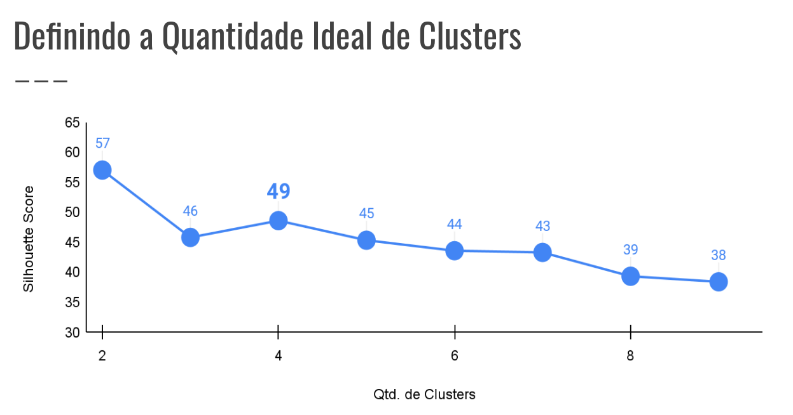
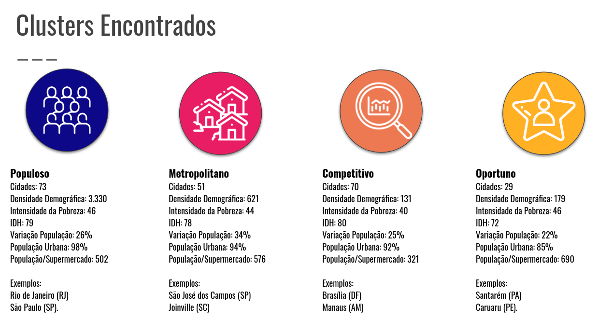
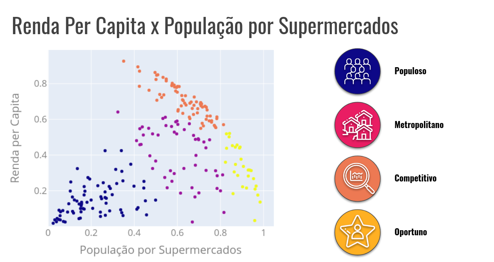
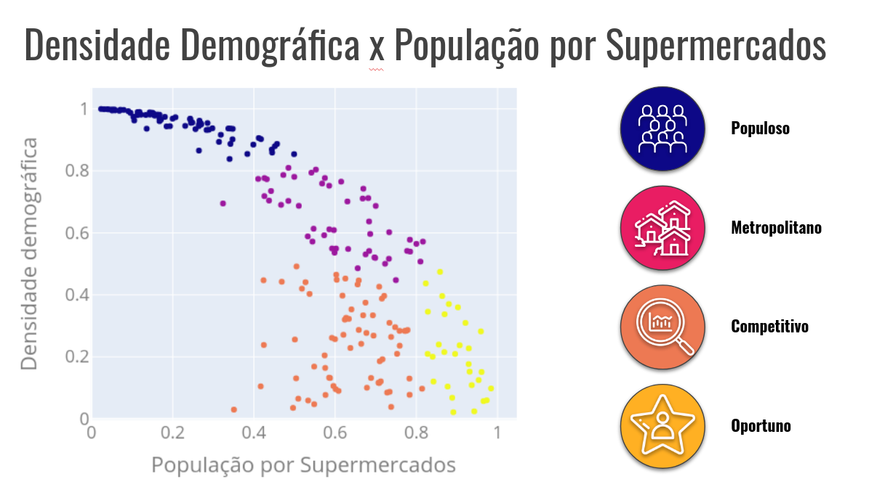

Case Plusoft Supermercados
==============================

## Cenário
Uma grande multinacional varejista do ramo de supermercados deseja ingressar no mercado brasileiro e o Data Analyst está responsável pelo estudo demográfico que servirá de base para a estratégia de entrada dessa empresa no Brasil.

Este trabalho foi elaborado como parte do processo seletivo para Data Analyst da Plusoft.

*O relatório em formato de apresentação pode ser visto em: <a target="_blank" href="https://docs.google.com/presentation/d/1Q5pxOEcnfcEVwr7Mubu5WsN-dPrkDzU6o4qPu6xu6C8/edit?usp=sharing/"> Link</a>.*

## Objetivos

Realizar as seguintes tarefas a partir das informações demográficas dos municípios brasileiros:
-  Classificar os municípios brasileiros com base nas informações disponíveis e caracterizá-los em grupos;
- Elaborar uma forma de classificar um novo município entre os grupos já criados na etapa anterior;
- Indicar quais grupos de municípios deveriam ser a porta de entrada para a empresa no país e porque.

Organização do Projeto
------------

    ├── README.md          <- The top-level README for developers using this project.
    ├── data
    │   ├── model          <- Dados para uso no script de cálculo do modelo.
    │   ├── interim        <- Dados em processamento
    │   ├── processed      <- Resultado final.
    │   └── raw            <- Dados Originais
    │
    ├── models             <- Modelo para predições únicas
    │
    ├── notebooks          <- Jupyter notebooks. Númerados de 01 a 03 de acordo com o objetivo.
    ├── reports            <- relatórios e imagens para apresentação.

--------

## Bases Utilizadas
1. Base de Informações Demográficas dos Municípios Brasileiros: base disponibilizada pela Plusoft com informações demográficas do IBGE de todos os municípios do Brasil.
2. Para compor a análise foi utilizado a Base do Cadastro Nacional da Pessoa Jurídica: dados da Receita Federal, com informações do registro de CNPJ por município. (Diponível em: [Link](https://github.com/georgevbsantiago/qsacnpj) - Neste Relatório foi utlizado a base Base de dados liberada pela RFB no dia 15/05/2019 em formato SQLite)

## Premissas
- Para fins de estudo foram utilizadas somente linhas com pelo menos 100.000 habitantes, totalizando 223 municípios.ípi

## Variáveis Utilizadas
- **Densidade demográfica, 2000:** distribuição espacial dos habitantes por quilômetro quadrado e os principais sistemas de transporte. 
- **Renda per Capita:** A renda per capita é obtida mediante a divisão da Renda Nacional (isto é, Produto Nacional Bruto menos os gastos de depreciação do capital e os impostos diretos) pelo número de habitantes do país. 
- **Intensidade da Pobreza:** percentual das pessoas consideradas como indigentes, ou seja, aqueles cuja renda familiar per capita é inferior ao valor necessário para atender tão-somente às necessidades básicas de alimentação. 
- **Índice de Desenvolvimento Humano Municipal:** uma medida resumida do progresso a longo prazo em três dimensões básicas do desenvolvimento humano: renda, educação e saúde. 
- **Variação População 1991 a 2000:** variação da população entre 1991 e 2000.
- **Percentual População Urbana:** População Urbana sobre a população total.
- **População por Supermercado:** quantidade total de CNPJs do CNAE 4711301 e 471102, referente aos supermercados disponibilizados pela Receita Federal do Brasil, divididos pela população do município.

## Clusterização com K-means
**O que é K-Means?**
K-Means é um algoritmo de clusterização (ou agrupamento) disponível na biblioteca Scikit-Learn. É um algoritmo de aprendizado não supervisionado (ou seja, que não precisa de inputs de confirmação externos) que avalia e clusteriza os dados de acordo com suas características. [Fonte](https://medium.com/programadores-ajudando-programadores/k-means-o-que-%C3%A9-como-funciona-aplica%C3%A7%C3%B5es-e-exemplo-em-python-6021df6e2572)

**Coeficiente de Silhouette**
O Coeficiente Silhouette é calculado usando a distância média intra-cluster (a) e a distância média mais próxima do cluster (b) para cada amostra.

** Escolhendo a quantidade Ideal de Clusters

Visto o score será escolhido a quantidade de 4 clusters.

## Cluster Encontrados

## Renda Per Capita x População por Supermercados

## Densidade Demográfica x População por Supermercados**

## Conclusões
- Considerando as cidades com pelo menos 100 mil habitantes, as cidades do cluster “Oportuno” são as melhores alternativas para a empresa ingressar no Brasil, uma vez que apresentam menor índice de competitividade (População por Supermercado).

- Não é indicado o investimento nas cidades do cluster “Competitivo”. Estas já possuem alto volume de supermercados por habitantes.

- O cluster “Populoso” pode ser considerado uma alternativa conservadora de investimento, visto que possui as maiores cidades do país.

<small>Project based on the <a target="_blank" href="https://drivendata.github.io/cookiecutter-data-science/">cookiecutter data science project template</a>. #cookiecutterdatascience</small>

